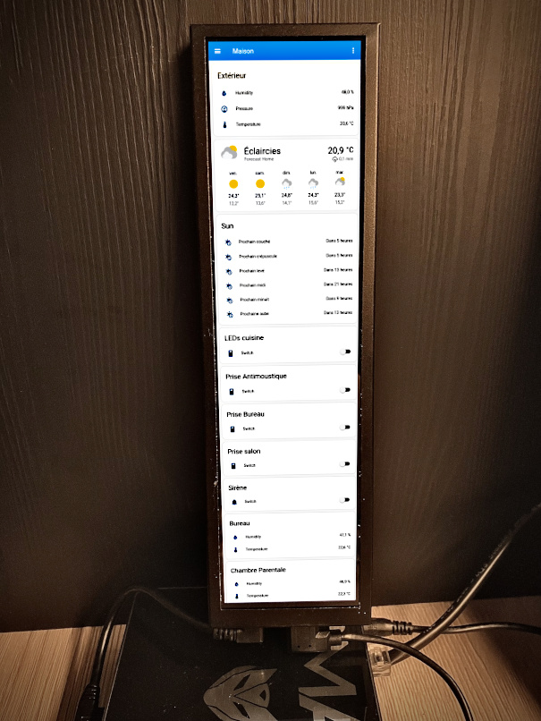

# HA rig and Zigbee stuff

----

## The hub

I didn't choose Raspberry PI (current prices are above small PC ones). But this should do the trick.

| Designation | Description | Buy link / Price | Comment |
| ----------- | ----------- | ---------------- | ------- |
| SBC         | BMAX        | [Amazon](https://www.amazon.fr/Windows-N4020C-Desktop-Computer-Dual-Band/dp/B09YTRWJQM) (109€) | RJ45, 2xUSB3, HDMI, audio jack |
| Zigbee HUB  | Conbee II   | [Amazon](https://www.amazon.fr/Dresden-ConBee-Electronique-II/dp/B07PZ7ZHG5) (30€)| Any other HUB should do as long as Zigpy supports it|
| Display     | 8,8" IPS    | [Makerfabs](https://makerfabs.shop/products/makerfabs-8-8-inch-display-screen-1920-480-ips-screen-lcd-panel-hdmi-interface-driver-board) (60€) | 480x1920 60Hz Black frame and Capacitive Touch, used as HMI but somehow optional |


## Zigbee Accessories

Proposed, tested, suggested and useful Zigbee stuff

| Designation    | Description | Buy link / Price | Comment |
| -------------- | ----------- | ---------------- | ------- |
| LED Driver     | ~230V to =12V 15W | [Amazon](https://www.amazon.fr/dp/B09LCDPWXK) (11€) | Not Zigbee driven |
| LEDs ribbon    | 3000K 12V White 5m cuttable | [Amazon](https://www.amazon.fr/dp/B09LCDPWX) (10€) | Cheap. Reeled |
| Plugs          | EU ~230V 16A | [AliExpress](https://fr.aliexpress.com/item/1005002344798281.html?spm=a2g0o.order_list.order_list_main.47.176b5e5bJMNxYj) (~8€) | Not Tuya specific. Does switching and various electrical measurements. Zigbee router |
| LED Dimmer     | MiBoxer @ Mi Light | [AliExpress](https://fr.aliexpress.com/item/1005005124890685.html) (15€) | Highly recommended |
| Power Switch   | 16A 230V | [AliExpress](https://fr.aliexpress.com/item/1005003788240931.html?spm=a2g0o.order_list.order_list_main.26.176b5e5bJMNxYj) (5€) | Zigbee Switch possibly paired with switch. Can manage manual and zigbee control |
| Power Meter    | Intensity measured with clamp | [AliExpress](https://fr.aliexpress.com/item/1005004948381800.html) (23€) | Used to measure instant consumption and also for summation statistics. ZhaQuirk needed |
| Switches | MOES Scene switches 4 gang |  [AliExpress](https://fr.aliexpress.com/item/1005004986809020.html?spm=a2g0o.order_list.order_list_main.16.176b5e5bJMNxYj) (13€) | Not tested yet, CR2430 required |
| Sensor | Presence detector |  [AliExpress](https://fr.aliexpress.com/item/1005005137135170.html?spm=a2g0o.order_list.order_list_main.32.176b5e5bJMNxYj&gatewayAdapt=glo2fra) (5€) | Very small |
| Siren | NEO no sensors | [AliExpress](https://fr.aliexpress.com/item/4000813903996.html?spm=a2g0o.order_list.order_list_main.37.176b5e5bJMNxYj) (13€) | Not for cat owners, some melodies may make them snap. Door bells are ok. Many configurations |
| Sensor | Temperature, Humidity, Pressure from Aqara | [AliExpress](https://fr.aliexpress.com/item/32990414707.html?spm=a2g0o.order_list.order_list_main.42.176b5e5bJMNxYj) (16€) | Very small but nice autonomy |
| Sensor | Temperature, Humidity from Haozee | [AliExpress](https://fr.aliexpress.com/item/4000843004202.html?spm=a2g0o.order_list.order_list_main.51.176b5e5bJMNxYj) (15€) | Not Tuya specific, nice display |

----

## Home Assistant local server

The `BMAX` came with preinstalled W11, well I dumped it for a Debian 11 full installation on it.
The Wifi driver doesn't work well at all, so I preferred a conventional Ethernet cable directly connected to my home ISP gateway (French Livebox4 from Sosh).

I initially installed MATE desktop environment but it is definitely useless even with HMI proposed here.
The small 480x1920 IPS display with capacitive touch has been assigned to permanently display Home Assistant web page. I'll describe that later on.

The whole Zigbee setup is based on Home Asssistant solution with ZHA integration. Fully Python written but quite nice and very very flexible. I experimented Jeedom but quicky dumped it, it lags behind too many zigpy versions and new devices supports is hectic.

### Baseline

I didn't choose Docker or HAOS. Bloated. I preferred core version. At least I know what I do and since I'm Linux user for over 30 yrs no need to follow the beginners path.
Instructions are [here](https://www.home-assistant.io/installation/linux#install-home-assistant-core).

Created a dedicated `homeassistant` unprivileged user (only fools run things as root).
```bash
# useradd -m -s /in/bash homeassistant
# adduser homeassistant dialout
```
To properly access Conbee 2 USB adapter it is needed to include user to `dialout` group.

### Home Assistant installation

#### Python 3.10
On Debian 11 you need to build Python3.10.xx. As root:
``` bash
# apt-get install build-essential gdb lcov pkg-config \
      libbz2-dev libffi-dev libgdbm-dev libgdbm-compat-dev liblzma-dev \
      libncurses5-dev libreadline6-dev libsqlite3-dev libssl-dev \
      lzma lzma-dev tk-dev uuid-dev zlib1g-dev
# wget https://www.python.org/ftp/python/3.10.11/Python-3.10.11.tgz
# cd Python-3.10.11/
# ./configure --enable-optimizations
# make -j
# make altinstall
```

####
To install Home Assistant software, I just created a `/opt/homeassistant` directory owned by `homeassistant` user.
As root:
``` bash
# mkdir /opt/homeassistant
# chown homeassistant:homeassistant /opt/homeassistant
# sudo -i -u homeassistant
homeassistant:/opt/homeassistant$ python3.10 -m venv .
homeassistant:/opt/homeassistant$ source bin/activate
(homeassistant) homeassistant:/opt/homeassistant$ python3 -m pip install wheel
(homeassistant) homeassistant:/opt/homeassistant$ pip3 install homeassistant==2023.5.4
(homeassistant) homeassistant:/opt/homeassistant$ hass
```

On first run it may take a while but `Home Assistant` will be available at http://localhost:8123 or change localhost to whatever hostname possibly seen on your local network (HA does use mdns and it conflicts with default avahi setup). My ISP gateway running DHCP service let me see it at `homeassistant.home`.

We'll need a few configuration tweaks and add `Home Assistant` as a service.

#### Configuration adjustments
Additional stuff
``` yaml
...
# Reverse Proxy
http:
  use_x_forwarded_for: true
  trusted_proxies: 127.0.0.1

# ZHA
zha:
  custom_quirks_path: /home/homeassistant/quirks
```

---
## HMI
With this nifty IPS 8.8" display I wanted to give the user the possibility to access `Home Assistant` directly without a PC or smartphone.
The idea here is to run `chromium` in kiosk mode. The kiosk mode makes `chromium` run in fullscreen mode so making the impression of running a entire application on the screen.

There are many complicated setups to achieve this on Raspberry. Most rely on desktop management with autologin and autostart thingies. Come on! This is not the way.
I think some Linux users think to much the Windows way. It's to understand what you're doing.

You just need start a X11 session with `chromium` as the unique X11 running application.

Disable any desktop management if installed, by default it's lightdm.
``` bash
$ sudo systemctl disable lightdm.service
```
You should get the console, just log in as `homeassistant` user. Then:
``` bash
$ xinit /usr/bin/chromium --kiosk --window-position=0,0 --window-size=480,1920 http://localhost:8123" -- :0 vt1 -ac -keeptty -nolisten tcp -nocursor -novtswitch
```

And tada, display switches to a nice fullscreen with Home Assistant home page displayed. Log in with HA user and password, don't forget to check *Stay connected* option. You need a keyboard for that, temporarely. That's it:



A bit of explanation on options. `-nolisten tcp` will prevent from accessing to X11 display though tcp. `-nocursor` will prevent Xorg from displaying the mouse pointer (cursor) since we have a capacitive touch. And no need to use `unclutter` :). Rest is classic X11 startup options.

Now we need to start this as a service. We need to run root that owns the console at boot stage and this is needed for X11 to acquire tty. If we try to start the service with unprivileged user we'll fail to access tty by lack of permissions. We could proceed with `chromium` runing as root but this would be very unsafe.
We must switch to unprivileged user for `chromium` to properly run the sandbox protection as well. As a reminder, `homeassistant` user is unprivileged.
So the final start line is a tiny bit more complicated. But it's all in the [`homeassistant-display.service`](homeassistant-display.service) unit file for systemd.


---

## Reverse Proxying from VPS
If you have your own server and you'd like to access your HA server from outside, here is a simple
setup that doesn't need to open any ports on your ISP gateway.

Let's target https://ha.example.net as the entry point to your HA server.

The idea is to establish a ssh tunnel from home server to VPS. **No incoming connection** on home gateway.
Need a non privileged account on VPS (here it's `ha` with no login at all).
Install local HA server `homeassistant`'s ssh public key on VPS's `ha` user account.

Running [`tunnel-ha.service`](tunnel-ha.service) on local server sets up the tunnel.

It launches:
``` bash
$ ssh -R9000:127.0.0.1:8123 -n -N ha@example.net
```

Any connection on VPS's 9000 tcp port is forwarded to local HA server's usual 8123 port.
You'll need the extra configuration lines in `configuration.yaml` (see above) to properly handle requests from proxy.

Apache config on VPS:
``` apache
<IfModule mod_ssl.c>
<VirtualHost *:443>
	ServerName ha.example.net

	ServerAdmin webmaster@localhost
	DocumentRoot /var/www/ha

	ErrorLog ${APACHE_LOG_DIR}/ha_error.log
	CustomLog ${APACHE_LOG_DIR}/ha_access.log combined

	#Header always set Strict-Transport-Security "max-age=15552001; includeSubDomains;"

	RewriteEngine on
	RewriteCond %{HTTP:Upgrade} websocket [NC]
	RewriteCond %{HTTP:Connection} upgrade [NC]
	RewriteRule ^/?(.*) "ws://127.0.0.1:9000/$1" [P,L]

	ProxyPass / http://127.0.0.1:9000/
	ProxyPassReverse / http://127.0.0.1:9000/
	ProxyRequests Off

        SSLCertificateFile /etc/letsencrypt/live/example.net/fullchain.pem
        SSLCertificateKeyFile /etc/letsencrypt/live/example.net/privkey.pem
        Include /etc/letsencrypt/options-ssl-apache.conf
</VirtualHost>
</IfModule>
```
